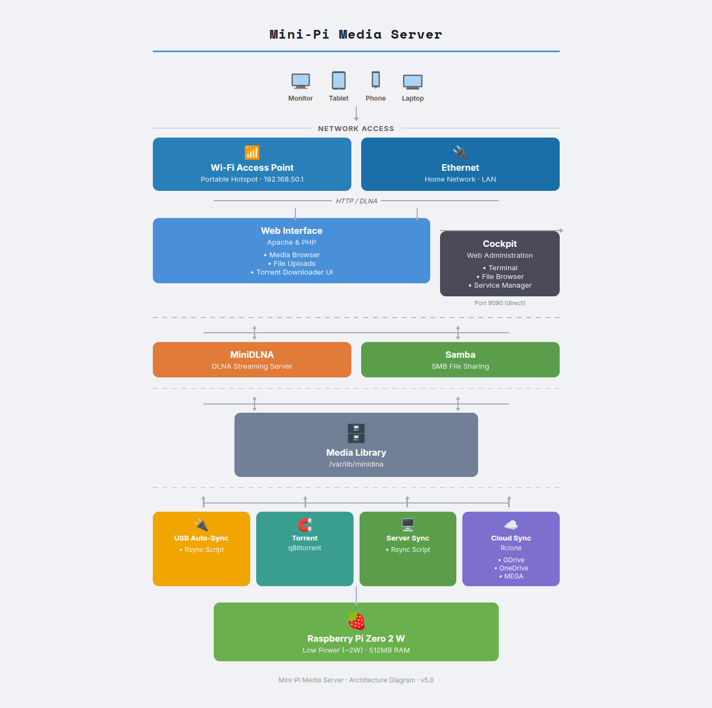

# 🥧 Mini-Pi Media Server

**A lightweight, all-in-one media server optimized for Raspberry Pi Zero 2 W through Raspberry Pi 5.**

What is it? A very lightweight media server that can run on a Raspberry Pi zero 2 w up to a Raspberry Pi 5. Version 4.3 onwards has the onboard wifi as an access point that the pi routes network traffic through to the ethernet port as well as hosting minidlna, cockpit, samba and apache onto both networks.
Users of a Pi zero 2 W will need a USB to WIFI adapter to route network traffic for at home and hosting the Mini-Pi Media server on a home network.

[](https://www.youtube.com/watch?v=HLibPLdSw-g)

---

## 📺 What’s Inside?
* **Samba:** Local network file access, optimized for low-memory environments.
* **Cockpit:** Web-based remote administration.
* **MiniDLNA:** Lightweight streaming to Smart TVs with custom directory scanning.
* **Apache:** Web-based streaming and file access using efficient directory aliasing.
* **Transmission-Daemon:** Torretnt downloader where you can stack up a load of downloads
* **Media Scraper:** Auto-pulls movie posters and synopses daily at 5 AM.
* **Auto-Conversion:** Background service converts MKV to MP4 at midnight for maximum compatibility.

---

## 🚀 Quick Install
Run this single command in your Raspberry Pi terminal to begin the automated setup:

```bash
wget -qO- https://raw.githubusercontent.com/diddy-boy/mini-pi-media-server/main/install.sh | bash

## 🚀 Architecture Diagram

